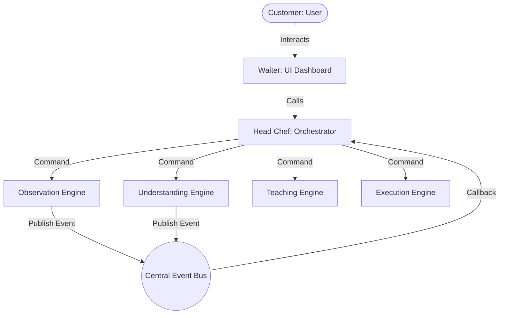

# ECHO Version 1.0.0 Overview & Architecture Manual

This document provides a comprehensive technical overview of **ECHO (Execution through Continuous Human Observation)** v1.0.0. It explains how the core components are structured, how the AI models are trained, and how data flows through the application.

---

## 📂 Codebase Folder Structure

The project conforms to an **Engine-Based Layered Architecture**, grouping files by their specific functional domains:

```
ECHO/
│
├── app/
│   ├── controller/
│   │   └── orchestrator.py             # Head Chef: Coordinates all engines and state transitions
│   │
│   ├── engines/
│   │   ├── execution/
│   │   │   └── execution_engine.py     # Autonomously plays back learned tasks using OS automation
│   │   ├── explainability/
│   │   │   └── explainability_engine.py# Softmax probability logger explaining the AI's actions
│   │   ├── observation/
│   │   │   └── observation_engine.py    # Monitors keyboard/mouse threads and grabs screenshots
│   │   ├── safety/
│   │   │   └── safety_engine.py        # Panic halt monitor listening for the 'Esc' key
│   │   ├── teaching/
│   │   │   └── teaching_engine.py      # Preprocesses logs and trains the local PyTorch MLP model
│   │   └── understanding/
│   │       └── understanding_engine.py # Aggregates raw clicks/keystrokes into semantic steps
│   │
│   ├── models/
│   │   └── workflow_model.py           # PyTorch WorkflowMLP network class definition
│   │
│   ├── services/
│   │   ├── config/
│   │   │   └── config_manager.py       # Reads settings from config.yaml with dot-notation
│   │   ├── events/
│   │   │   └── event_bus.py            # Centralized Publish/Subscribe event dispatcher
│   │   ├── logging/
│   │   │   └── logger.py               # Dual-target file & console logging system
│   │   └── utilities/
│   │       └── window_helper.py        # Obtains current active window titles across OS APIs
│   │
│   └── ui/
│       └── gui_app.py                  # CustomTkinter dark-mode desktop user interface
│
├── data/                               # Persistent directory (ignored by git, except directory structure)
│   ├── logs/                           # Runtime log files (e.g. echo.log)
│   ├── observations/                   # Raw screenshots, event JSONs, and workflow summaries
│   ├── task_library/                   # User-saved tasks (reusable model + sequence weights)
│   └── trained_models/                 # Runtime PyTorch weight models
│
├── tests/
│   └── test_engines.py                 # PyTest/UnitTest test suite for core utilities
│
├── requirements.txt                    # Project package dependencies
├── config.yaml                         # Global settings and observations directory path config
├── README.md                           # Quickstart guide and analogies
└── main.py                             # Main application launcher
```

---

## 🍽️ System Analogy & Orchestration Flow

ECHO utilizes a decoupled architecture where components are isolated and communicate asynchronously.



### 1. The Head Chef (Orchestration)
The [Orchestrator](file:///d:/project/ECHO/app/controller/orchestrator.py) is the central state controller. It subscribes to lifecycle events on the `EventBus` (e.g. `OBSERVATION_STARTED`, `OBSERVATION_STOPPED`) and triggers appropriate engine actions like starting analysis, initiating learning, and playing back automation.

### 2. The Kitchen Bell (Event Bus)
The [EventBus](file:///d:/project/ECHO/app/services/events/event_bus.py) provides a thread-safe publish-subscribe mechanism. It registers listener callbacks mapped to string keys (e.g., `WORKFLOW_UNDERSTOOD`) and fires them sequentially whenever an event is published, allowing engines to remain completely decoupled.

---

## 🔍 Engine Mechanics: How Each Cook Works

### 1. Observation Engine
The [ObservationEngine](file:///d:/project/ECHO/app/engines/observation/observation_engine.py) acts as the system recorder:
* **Background Threading**: Launches asynchronous daemon listeners using `pynput.mouse.Listener` and `pynput.keyboard.Listener`.
* **Modifier Key Tracking**: Maintains an in-memory set (`active_modifiers`) tracking helper keys (like `Ctrl`, `Shift`, `Alt`) to form compound shortcut descriptors (e.g., `ctrl+c`).
* **Visual Checkpoints**: Spawns a background worker thread (`_screenshot_loop`) which periodically grabs screenshots via `PIL.ImageGrab` at configured intervals and qualities, saving them as files named `screenshot_0000.jpeg`.
* **State Mapping**: Logged actions contain both absolute display coordinates `(x, y)` and window-relative coordinates `(rel_x, rel_y)` calculated using active window boundaries.

### 2. Workflow Understanding Engine
The [WorkflowUnderstandingEngine](file:///d:/project/ECHO/app/engines/understanding/understanding_engine.py) parses the raw observed `events.json` log and compresses it into high-level steps:
* **Keyboard Consolidation**: Rather than logging individual character events, it buffers keystrokes until a window change or a time gap exceeding `3.0` seconds occurs. At that point, it aggregates the buffered characters into a single semantic action step, e.g., `Type 'google.com'`. It supports `backspace` editing within the buffer.
* **Double-Click Upgrading**: When it detects consecutive left-mouse presses on the same coordinate zone (< 10px distance) within `0.5` seconds, it replaces the two clicks with a single consolidated `Double Click` action.
* **Goal Heuristic**: A simple classifier analyzes the set of unique active applications used during the session to automatically label the task (e.g. if both Chrome and Notepad were active, it labels the task as "Data Extraction & Text Logging").

### 3. Teaching Engine (Behavioral Cloning AI)
The [TeachingEngine](file:///d:/project/ECHO/app/engines/teaching/teaching_engine.py) converts raw desktop actions into training features for behavioral cloning:
* **Feature Vector**: For every action step (excluding mouse movements or key releases), the engine generates a 3-dimensional numeric feature vector:
  $$\mathbf{x} = [\text{Window ID}, \text{Elapsed Time}, \text{Last Action ID}]$$
  * `Window ID`: A unique float index assigned to the active window title.
  * `Elapsed Time`: The float timestamp since recording started.
  * `Last Action ID`: The previous action classification label.
* **Target Classes**: The engine maps events to 4 integer target action classes:
  * `0`: Clicks
  * `1`: Typing & Keypresses
  * `2`: Mouse scrolling
  * `3`: Task Finish (appended as a final marker to teach the model when to halt execution).
* **Neural Network**: It builds a simple **Multi-Layer Perceptron (MLP)** called `WorkflowMLP`:
  ```python
  class WorkflowMLP(nn.Module):
      def __init__(self, input_dim=3, hidden_dim=16, num_classes=4):
          super(WorkflowMLP, self).__init__()
          self.fc1 = nn.Linear(input_dim, hidden_dim)  # Linear map (3 -> 16)
          self.relu = nn.ReLU()                        # Activation function
          self.fc2 = nn.Linear(hidden_dim, num_classes)# Linear map (16 -> 4)
  ```
* **Adam Training**: Optimizes weights using PyTorch `CrossEntropyLoss` and the `Adam` optimizer across `100` epochs, saving the model weights file (`model.pth`) and the window-to-index translation dictionary (`window_map.json`).

### 4. Execution Engine
The [ExecutionEngine](file:///d:/project/ECHO/app/engines/execution/execution_engine.py) loads the model weights and plays back steps:
* **Perception Phase**: At each step, it checks the active window title via `window_helper.py` and matches it against `window_map.json` using fuzzy title matches to fetch the corresponding numeric `Window ID`.
* **Inference Phase**: It constructs the current state feature vector and runs a forward pass through the trained model:
  $$\mathbf{\hat{y}} = \operatorname{argmax}(\text{model}(\mathbf{x}))$$
* **Action Phase**: It triggers actions using `pynput.mouse.Controller` and `pynput.keyboard.Controller`:
  * **Window Targeting**: If the recorded active window is not focused, it utilizes `pygetwindow` to bring it to the foreground, restore it if minimized, and activate it before replaying mouse or keyboard inputs.
  * **Window-Relative Clicks**: Calculates the absolute coordinate:
    $$x_{\text{abs}} = x_{\text{win\_left}} + x_{\text{rel}}$$
    $$y_{\text{abs}} = y_{\text{win\_top}} + y_{\text{rel}}$$
    This makes coordinate playback highly resilient even if the application window has been moved to a different part of the screen.
  * **Double Clicks**: Implements a robust double-click sequence on Windows by calling `.press` and `.release` twice with a short time buffer (`0.05`s) to avoid OS event drops.

### 5. Safety Engine
The [SafetyEngine](file:///d:/project/ECHO/app/engines/safety/safety_engine.py) acts as a background monitor. During playback, it runs a pynput keyboard listener. If it catches the `Esc` key, it flags `panic_triggered = True`. At the beginning of each step replay, `execution_engine` calls `check_safety()`, which immediately raises a `KeyboardInterrupt` if panic is flagged, stopping all automation instantly.

### 6. Explainability Engine
The [ExplainabilityEngine](file:///d:/project/ECHO/app/engines/explainability/explainability_engine.py) passes the model's raw output logits through a Softmax layer:
$$\text{Probability}(c) = \frac{e^{z_c}}{\sum_{j} e^{z_j}}$$
It prints out the percentage confidence score for the selected action class alongside step details, giving the user transparent visibility into *why* the neural network chose that step.

---

## 📝 Data Formats & Schemas

### 1. `events.json` (Raw Observations)
Contains chronological timestamps and details for every raw mouse, keyboard, and screenshot event:
```json
{
    "session_id": "session_20260706_214500",
    "start_time": "2026-07-06T21:45:00.123456",
    "total_events": 3,
    "events": [
        {
            "type": "mouse_click",
            "timestamp": 1.25,
            "active_window": "Untitled - Notepad",
            "x": 450,
            "y": 300,
            "rel_x": 120,
            "rel_y": 150,
            "button": "left",
            "pressed": true
        },
        {
            "type": "key_press",
            "timestamp": 2.1,
            "active_window": "Untitled - Notepad",
            "key": "h"
        },
        {
            "type": "screenshot",
            "timestamp": 3.0,
            "active_window": "Untitled - Notepad",
            "file_path": "screenshot_0000.jpg"
        }
    ]
}
```

### 2. `workflow_summary.json` (Structured Workflow)
A consolidated representation containing segmentations and guessed goals:
```json
{
    "session_id": "session_20260706_214500",
    "workflow_name": "Text Document Editing",
    "goal": "Write or modify desktop documents.",
    "apps_used": ["Notepad"],
    "total_duration_sec": 3.5,
    "confidence_rating": 0.95,
    "steps": [
        {
            "action": "Click LEFT at relative (120, 150)",
            "window": "Untitled - Notepad",
            "timestamp": 1.25,
            "rel_x": 120,
            "rel_y": 150,
            "x": 450,
            "y": 300,
            "double_click": false
        },
        {
            "action": "Type 'hello'",
            "window": "Untitled - Notepad",
            "timestamp": 2.1
        }
    ]
}
```

---

## 🖥️ Graphical User Interface (GUI)

The CustomTkinter visual dashboard provides a modern dark-themed window structure:
* **Dropdown Menu**: Scans the `data/task_library` directory recursively, displaying saved workflows. Selecting a task automatically loads its corresponding model and steps.
* **Logging Console**: A read-only CTkTextbox showing real-time feedback from the `logger` output.
* **Task Library Actions**: Allows the user to type a name into the input field and click "Save to Library" to move the currently trained model weights and workflow summary to the task library.
* **Non-Blocking Background Threads**: Training and playback tasks run on separate `threading.Thread` instances to ensure that the GUI window remains highly responsive and does not freeze during intensive tasks.
