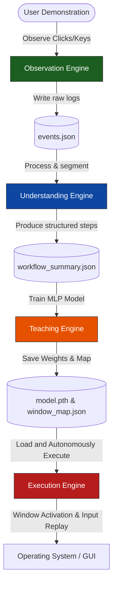

# ECHO: Execution through Continuous Human Observation 🤖

**ECHO** is an intelligent, local-first desktop learning assistant designed to automate repetitive workflows by learning directly from user demonstrations rather than relying on manually programmed macros or automation scripts.

Instead of writing scripts, users simply perform the task naturally. ECHO observes visual frame states, keystrokes, and clicks to build a behavioral cloning policy capable of reproducing the same task autonomously.

---

## 🍽️ System Architecture & Data Flow

ECHO is designed using a decoupled, **Engine-Based Layered Architecture** coordinated by a central orchestrator.



### The Restaurant Analogy
* **The Customer (User)**: Interacts with the interface to trigger commands.
* **The Waiter ([UI Dashboard](app/ui/gui_app.py))**: Simple CustomTkinter buttons to orchestrate states.
* **The Head Chef ([Orchestrator](app/controller/orchestrator.py))**: Glues all engines together by acting as a centralized state controller.
* **The Assistant Cooks (Engines)**:
  * 📷 **[Observation Engine](app/engines/observation/observation_engine.py)**: Grabs screenshots and logs multi-threaded mouse/keyboard events.
  * 🧠 **[Understanding Engine](app/engines/understanding/understanding_engine.py)**: Consolidates raw click/typing coordinates into structured chronological steps.
  * 🎓 **[Teaching Engine](app/engines/teaching/teaching_engine.py)**: Compiles feature sets and trains a PyTorch MLP model.
  * 🤖 **[Execution Engine](app/engines/execution/execution_engine.py)**: Plays back actions using local OS automation controllers and window-relative coordinates.
  * 🛡️ **[Safety Engine](app/engines/safety/safety_engine.py)**: Monitors for emergency panic abort hotkeys (e.g. `Esc` key).
  * 💡 **[Explainability Engine](app/engines/explainability/explainability_engine.py)**: Logs soft-max probabilities explaining *why* the AI selected each action.

For an in-depth dive into the internal design and data schemas, see the **[Docs/Version_1_Overview.md](Docs/Version_1_Overview.md)** document.

---

## 📂 Project Directory Structure

```
ECHO/
├── app/
│   ├── controller/      # Central orchestration layer
│   ├── engines/         # Business logic engines (Observation, Teaching, etc.)
│   ├── models/          # Machine learning model architectures (PyTorch MLP)
│   ├── services/        # Common utilities (Config, Logger, EventBus, Window helpers)
│   └── ui/              # Desktop GUI components (CustomTkinter)
├── data/                # Local data storage directory (Logs, Sessions, Library)
├── tests/               # Test suites verifying engine services
├── Docs/                # Project manuals and design documents (Volume 1-6 + Version 1 Overview)
├── config.yaml          # Application config file
├── requirements.txt     # Python package requirements list
└── main.py              # Application main entry point
```

---

## 🐶 The AI Model (Puppy Training Analogy)

ECHO trains a local Multi-Layer Perceptron (MLP) neural network in PyTorch using **Behavioral Cloning**:
* **The Senses (Inputs)**: Context vector containing `[Window ID, Elapsed Time, Last Action ID]`.
* **The Tricks (Targets)**: Integers matching action categories (`0` for click, `1` for type, `2` for scroll, `3` for exit/finish).
* **The Training**: An Adam optimizer tunes network parameters across 100 epochs, lowering cross-entropy loss until the model accurately mimics the demonstrated execution path.

---

## 🚀 Installation & Running

### 1. Setup Virtual Environment
```bash
# Create venv
python -m venv .venv

# Activate venv (PowerShell)
.venv\Scripts\Activate.ps1
```

### 2. Install Dependencies
```bash
# Install PyTorch (CPU-only) and utilities
pip install -r requirements.txt
```

### 3. Run Application GUI
```bash
python main.py
```

### 4. Run Automated Unit Tests
```bash
.venv\Scripts\python.exe -m unittest tests/test_engines.py
```

---

## 🧪 Key Project Features
* **Mouse Throttling**: Only logs mouse moves that cross a 15-pixel distance barrier and a 0.1s time gap to keep logs lightweight.
* **Keyboard Consolidation**: Automatically aggregates consecutive character logs into typed sentences rather than individual letters.
* **Fuzzy Window Matching**: Uses title string matching so playback succeeds even if browser tab names change slightly.
* **Emergency Halt Monitor**: Runs a background listener to abort actions immediately upon pressing the `Esc` key.
* **Window-Relative Playback**: Recalculates absolute coordinates using active window bounding regions so automation works even if window positions change.
